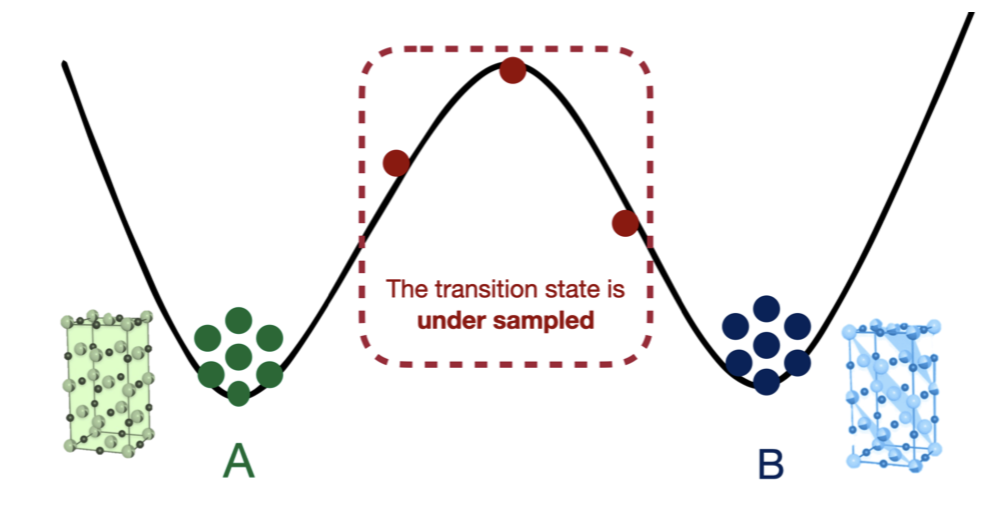

# InterState 

This repository contains the implementation of our paper ["Simultaneous Discovery of Reaction Coordinates and Committor Functions Using Equivariant Graph Neural Networks"](https://openreview.net/forum?id=NX2ROvVb2Y), presented at [NeurIPS AI4Mat 2024 Workshop](https://sites.google.com/view/ai4mat).

<p align="center">
  
</p>

## Instalation 

```bash
# To install the latest git commit 
git clone https://github.com/TRI-AMDD/interstate
cd interstate
pip install -e .
```

## Example of usage

The scripts and data necessary to reproduce the figures of the paper can be found in the [examples/](examples/) folder.

## Citing
If you use this repository in your work, please cite:

```
@inproceedings{
sheriff2024simultaneous,
title={Simultaneous Discovery of Reaction Coordinates and Committor Functions Using Equivariant Graph Neural Networks},
author={Killian Sheriff and Rodrigo Freitas and Amalie Trewartha and Steven Torrisi},
booktitle={AI for Accelerated Materials Design - NeurIPS 2024},
year={2024},
url={https://openreview.net/forum?id=NX2ROvVb2Y}
}
```

## Acknowledgements
We acknowledge Steven Torrisi and Amalie Trewartha for support and mentorship as intern advisors at TRI.

## Contact
If any questions, feel free to contact me (ksheriff at mit dot edu).
