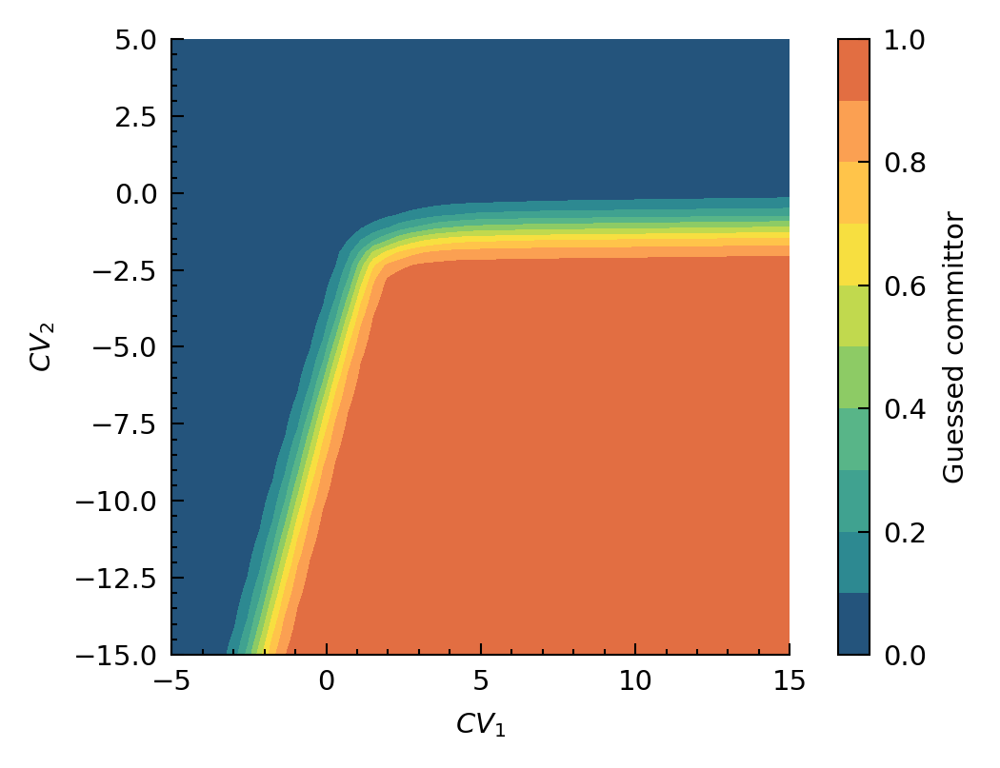
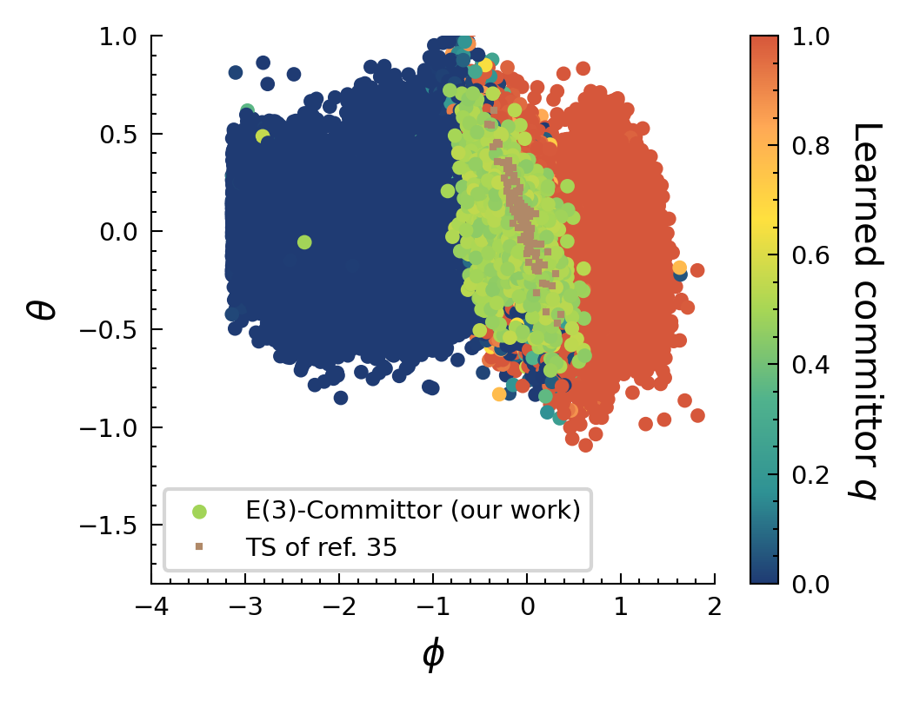
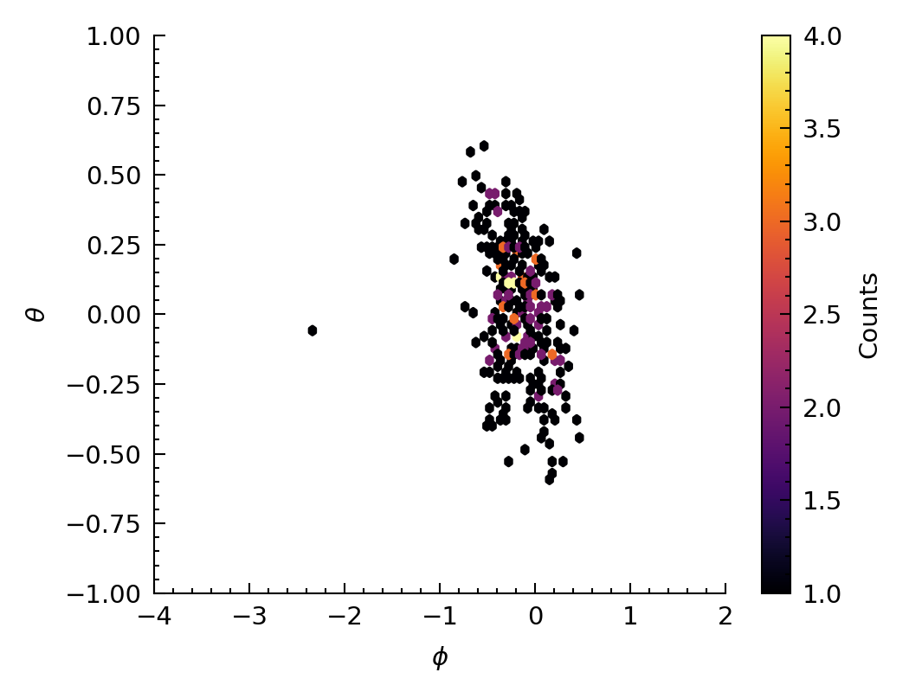
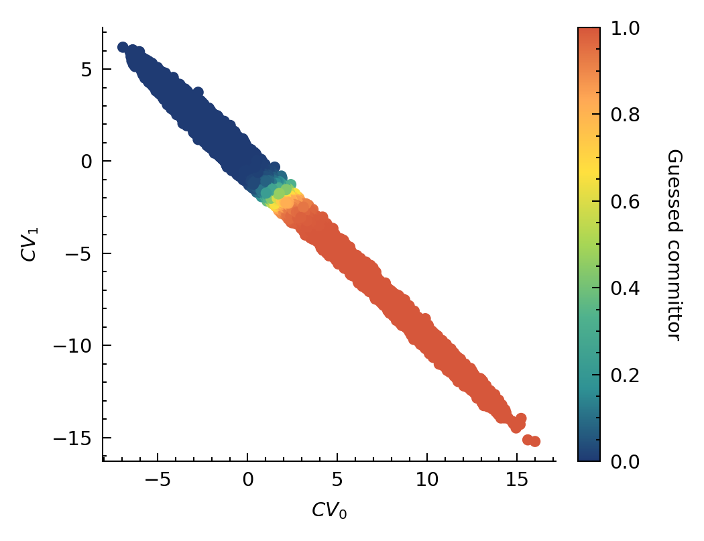

# Alanide dipeptide 

Application of **InterState** to atomistic simulations of alanide dipetitde. 

## Results 

#### How to find the TSE? 
You need to sample the discovered collective variable space! 

  

#### Is our TSE physical? 
To awser this, we compare with the real transition state of alanide dipeptide characterized by $\theta \approx -\phi$ (black line).
The guessed committor is evaluated on biased trajectories of Ala2 (from Parinello) and compared with physical collective variables (dihedral angles). This suggest that framework correctly defines the transition state.

  

  

#### Visualization of a Parinello biased simulations path in our discovered collective variable space 

  

## Limitations 
1. Check number of points that are in the TSE region (correct $\theta$, $\phi$), yet don't have a committor value of $\approx 0.5$.
2. In GromacsDataset code, check that atom types are in the good order (see **TODO** block).